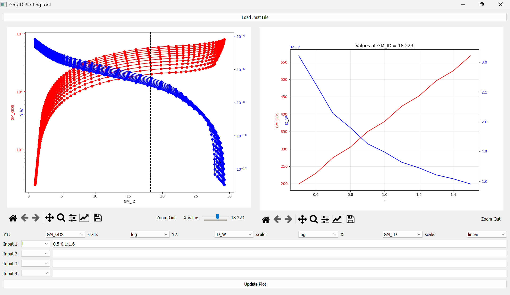
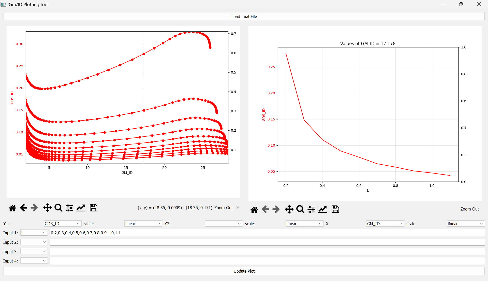

# Gm-ID-Methodology-Plotting-Tool

## Overview
This project is based on the `lookup.m` and `lookupVGS.m` functions originally developed by Paul Jespers and Boris Murmann in their book *Systematic Design of Analog CMOS Circuits*. These MATLAB functions were used to analyze and extract parameters from transistor simulation data.

The functions mentioned above are translated into Python to make them easier to use and more widely accessible. A simple GUI has also been created using PyQt5 and the `lookup.py` function to help plot transistor characteristic graphs quickly, removing the need for repetitive MATLAB scripting for generating the numerous graphs required when applying this methodology.

---

## Lookup and LookupVGS Functions in Python

### 1. Lookup Function:
This is the Python implementation of the `lookup` function. The `lookup` function is designed to extract specific subsets from multi-dimensional simulation data. It supports interpolation to evaluate points that lie off the predefined simulation grid.

#### Usage Modes:
- **Mode 1: Simple Parameter Lookup**: Retrieves the value of a single parameter for specified inputs.
- **Mode 2: Ratio Lookup**: Computes ratios of parameters (e.g., GM_ID) at specified input values.
- **Mode 3: Cross-Lookup**: Evaluates one ratio against another (e.g., GM_CGG for a given GM_ID).

#### Assumptions:
When specific inputs are not provided, the following defaults are used:
- **L**: Minimum channel length (`min(data['L'])`).
- **VGS**: Gate-source voltage vector (`data['VGS']`).
- **VDS**: Half the maximum drain-source voltage (`max(data['VDS']) / 2`).
- **VSB**: `0` (source-bulk voltage).

#### Syntax:
```python
lookup(data, 'output', 'input1', value1, 'input2', value2, ...)
```
- **`data`**: The `.mat` data, converted to a NumPy array using `scipy.io.loadmat`.
- **`output`**: The desired output parameter (string).
- **`input`**: Input parameter(s) (string).
- **`value`**: Value(s) for the corresponding input parameter. For stepwise arrays, use `np.arange(start, stop, step)`.

---

### 2. LookupVGS Function:

This script is a Python implementation of the `lookupVGS` function. It computes the gate-source voltage (VGS) of a MOSFET for a specified inversion level (GM_ID) or current density (ID/W) and terminal voltages.

#### Usage Modes:
- **Mode 1: Lookup VGS with a known source voltage (VSB):**  
  This mode calculates VGS with the following inputs:  
  - GM_ID (inversion level) or ID/W (current density).  
  - Channel length (L).  
  - Drain-source voltage (VDS).  
  - Source-bulk voltage (VSB).

- **Mode 2: Lookup VGS with an unknown source voltage:**  
  This mode applies when the source is at the tail node of a differential pair. In this case, VDB and VGB must be supplied to the function.

#### Assumptions:
When specific inputs (VSB, VDS, L) are not provided, the following defaults are used:
- **VSB**: `0` (source-bulk voltage).
- **L**: Minimum channel length in the dataset (`min(data.L)`).
- **VDS**: Half the maximum drain-source voltage in the dataset (`max(data.VDS) / 2`).

#### Syntax:
```python
lookup_vgs(data, input1=value1, input2=value2, ...)
```
- **`data`**: Similar to the lookup function, the `.mat` data is converted to a NumPy array using `scipy.io.loadmat`.
- **`input1`**: Must be GM_ID or ID_W.
- Other inputs can be given according to the requirements.

Both `lookup` and `lookupVGS` functions come with extensive examples demonstrating their usage. Refer to the examples provided in the codebase in case of any doubts regarding their usage.

---

## Usage Instructions for the Plotting Tool:

### Steps:
1. **Upload your `.mat` file**.
2. **Select axes**: Choose `y1`, `y2`, or both for the y-axes and define the x-axis.
3. **Provide inputs**: Specify up to 4 inputs.  
   - For multiple values, separate them with commas (e.g., `0.4, 0.5, 0.6`).  
   - For stepwise values, use a colon-separated format (e.g., `0.4:0.1:0.7`).
4. **Update the plot**: Click the "Update Plot" button.
5. **X-Slider**:
   - If inputs contain a varying parameter, use the x-slider to view how y-values change for a fixed x-value.
   - For instance, observe how `gm/gds` varies with `L` for a specific `gm/id` value.
   - No graph is generated if no varying parameter is present.
6. Use the magnifying glass and zoom-out buttons in the toolbar to explore the graph.




---

## Dependencies

- Python (>=3.6)
- NumPy
- SciPy
- Matplotlib
- PyQt5
  
To install the dependencies, run the following command:
```bash
pip install numpy scipy matplotlib PyQt5
```
## .mat files

GitHub does not allow uploading files larger than 25 MB via the web interface. I will upload a sample `.mat` files to this repository as soon as possible.
In the meantime, you can use the `.mat` files available in the **[Gm/Id starter kit by Prof. Boris Murmann et al.](https://github.com/bmurmann/Book-on-gm-ID-design)** to try out the plotting tool.

---

Feel free to contribute or raise issues to improve this project! 

